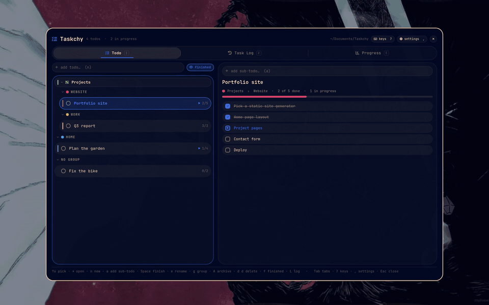
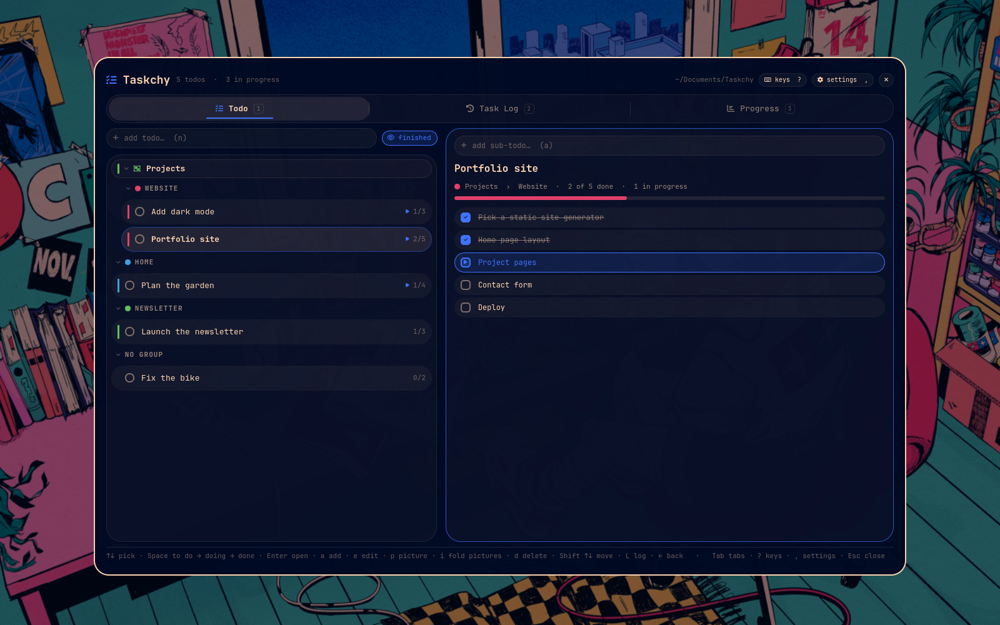
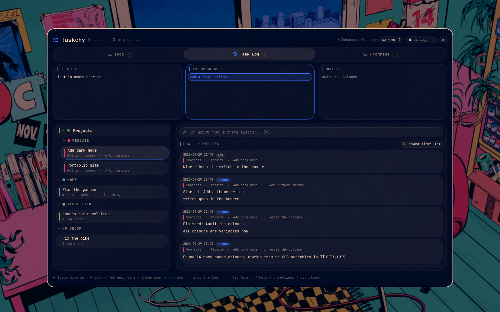
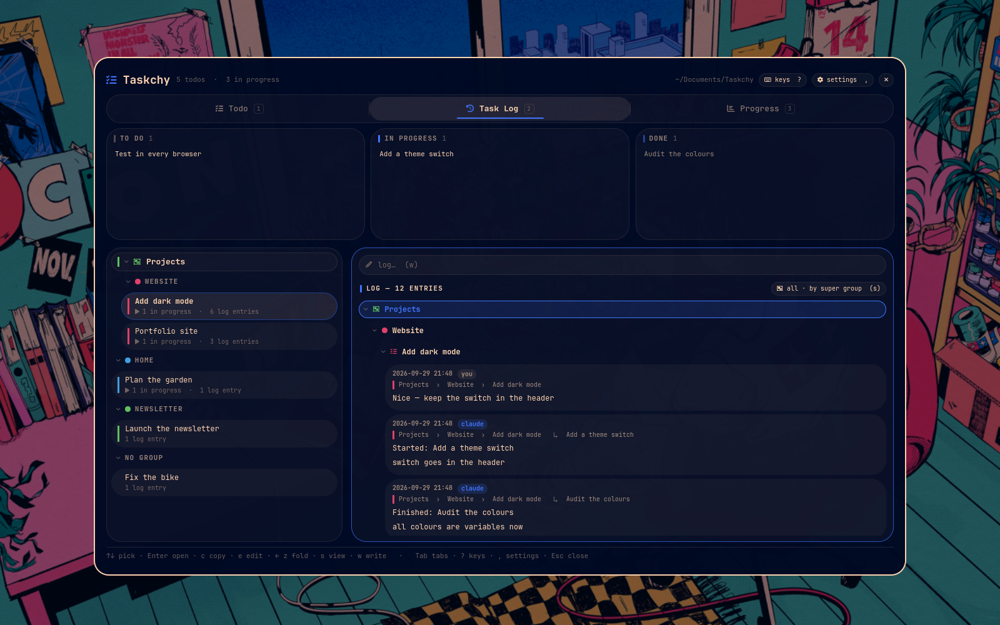
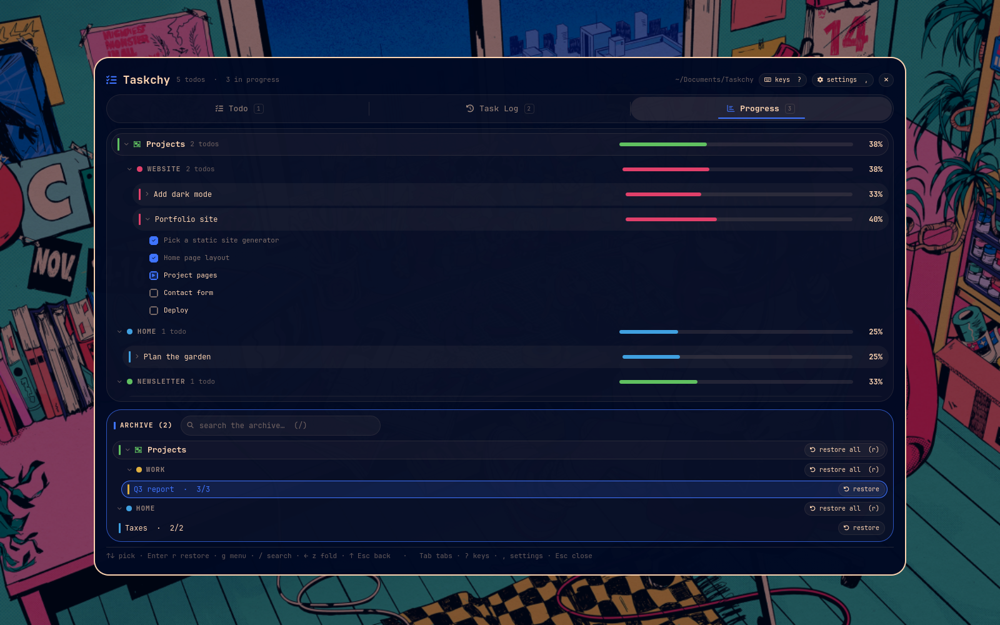
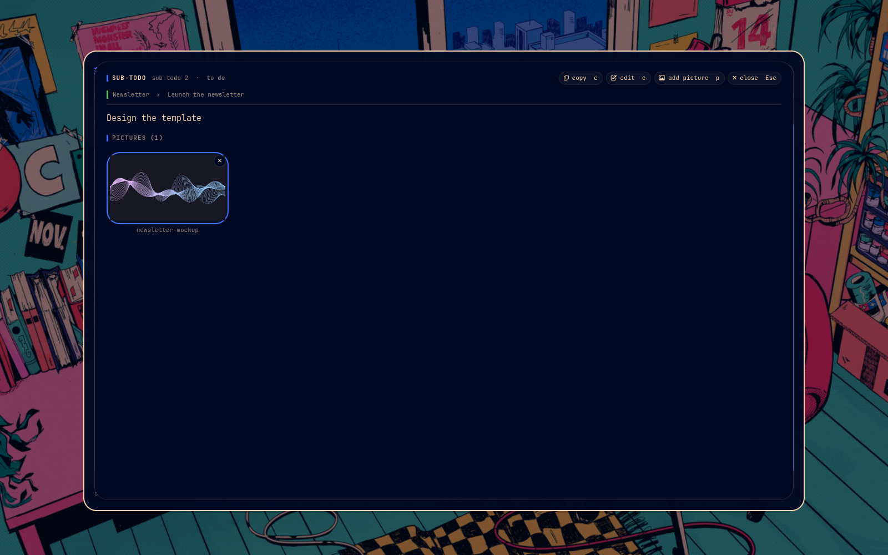
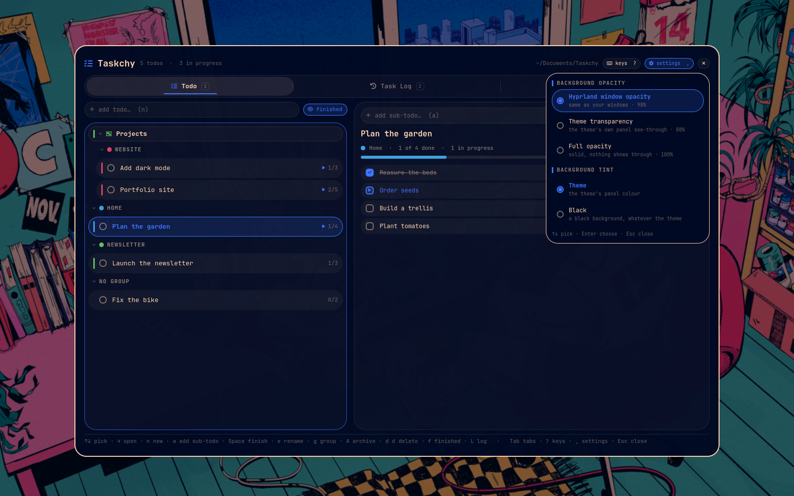
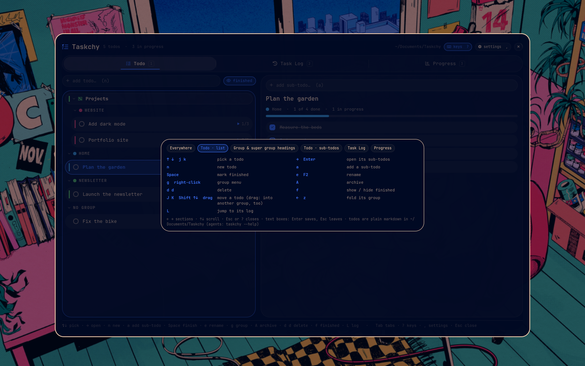

# Taskchy

A todo, task-log and progress app for [Omarchy](https://omarchy.org), living
in an overlay over your desktop. It takes its colours, font and corner
rounding from your current Omarchy theme, is fully keyboard driven, and can be
driven by coding agents (Claude Code or any other) through its `taskchy`
command, so you can watch an agent's work move across the board as it happens.

Everything is stored as plain markdown files, so any notes app or text editor
can read and edit your todos too.

I figured some might be interested but didn't want a cartoon slime theme and so Taskchy was born.



Taskchy started as a standalone fork of Slime Shell's Slime-Tasks. It has the
same features, a plain Omarchy look, and doesn't need Slime Shell.

## Features

### Three tabs

**Todo:** your todos on the left, the selected todo's sub-todos on the right.
- Add todos and sub-todos from the boxes at the top of each side.
- Sub-todos move *to do → in progress → done* (Space, or click the box).
- Organise todos into **groups** (each with its own colour) and groups into
  **super groups**. Groups and super groups fold away, and they can be
  renamed, reordered, archived or deleted as a whole.
- Reorder todos and sub-todos with the keyboard (Shift ↑↓, J/K) or drag and
  drop, including dragging a todo into another group.
- Hide or show finished todos.
- **Pictures on sub-todos:** attach reference images (examples, sketches,
  screenshots) from a built-in file picker or by dropping files on a
  sub-todo. They show as thumbnails you can fold, and open full size.

**Task Log:** what's being worked on right now.
- The selected todo's sub-todos sit in *to do / in progress / done* lanes
  across the top. Move them between lanes with the keys or a click (right
  click moves one back).
- Below is the todo's log: timestamped entries, tagged with who wrote them
  (you, or an agent) and which sub-todo they're about. Write your own from the
  box above the log. Entries are markdown, code blocks included.
- Five ways to view the log: this todo's newest first, grouped by sub-todo,
  or every todo's log grouped by todo, by group, or by super group. Sections
  fold, and every entry shows its full place (super group › group › todo ↳
  sub-todo).
- Open any entry or sub-todo full size to read, copy or edit it.

**Progress:** how far along everything is.
- A percentage and progress bar for every super group, group and todo.
  Expand a todo to see its sub-todos.
- Archive finished todos (one at a time, or a whole group or super group at
  once).
- The archive underneath is searchable and grouped the same way. Restore one
  todo, a whole group or a whole super group.

### Keyboard driven

Everything can be done from the keyboard. Tab or 1 2 3 switch tabs, Esc backs
out (or closes Taskchy), **?** shows every key, and the bar along the bottom
always lists the keys for wherever you are. Destructive keys ask twice (press
d d to delete).

### Themed by Omarchy

Colours, font, borders and corner rounding come from your current Omarchy
theme and change when you switch themes. The settings (the gear button, or
**,**) choose the background:

- **Opacity:** Hyprland's window opacity (matches your windows), the theme's
  own panel transparency, or fully solid.
- **Tint:** the theme's panel colour, or black.

### Built for agents

The `taskchy` command is the same backend the app uses. Every command prints
JSON, and the app re-reads the files every two seconds while it's open, so an
agent's progress shows up live. Writes are locked and atomic, so you and an
agent can't overwrite each other.

- **`taskchy plan`** creates a todo with all its sub-todos in one go, for when
  a project starts in a chat with an agent instead of in Taskchy. Running it
  again with the same title adds only the missing steps.
- **`taskchy start / log / finish`** move a sub-todo along and write to the
  log as the agent works.
- A **Claude Code skill** (`agent/taskchy/SKILL.md`) tells Claude to plan
  projects into Taskchy and log its work there. `agent/AGENTS.md` is the same
  instructions for any other agent.

## Screenshots

| | |
|---|---|
|  |  |
| **Todo:** groups, super groups and each todo's sub-todos | **Task Log:** the lanes, and Claude's log of its work |
|  |  |
| **Log views:** every todo's log, by super group › group › todo | **Progress:** how far along everything is, and the archive |
|  |  |
| **Sub-todos:** open one full size, with its pictures | **Settings:** background opacity and tint |



## Install

You need Omarchy (with its shell, `omarchy-shell`) and Python 3.

```sh
omarchy plugin add https://github.com/DasPoxy/taskchy.git --enable
~/.config/omarchy/plugins/taskchy/install.sh
```

The first line clones Taskchy into `~/.config/omarchy/plugins/taskchy` and
turns it on. Omarchy never runs a plugin's own scripts when it adds one, so the
second line is a separate step. It:

- links the `taskchy` command into `~/.local/bin/taskchy` (the app itself
  doesn't need it; you and your agents do), a link back into the plugin
  folder, so updates reach it too,
- creates the notes folder, `~/Documents/Taskchy`.

It never replaces a file, folder or link that isn't Taskchy's own.

The Claude Code skill is opt-in. To have Claude plan and log its work in
Taskchy, add `--claude-skill`:

```sh
~/.config/omarchy/plugins/taskchy/install.sh --claude-skill
```

That installs a **copy** of `agent/taskchy/` in `~/.claude/skills/taskchy`.
Being a copy, plugin updates never change the instructions your agents load;
run the command again when you want the latest version of the skill. It won't
replace a skill of the same name that Taskchy didn't install.

Open Taskchy with:

```sh
omarchy-shell shell toggle taskchy '{}'      # or '{"tab":"log"}' / '{"tab":"progress"}'
```

To give it a key, add a line to `~/.config/hypr/bindings.lua`:

```lua
o.bind("SUPER + CTRL + ALT + RETURN", "Taskchy", "omarchy-shell shell toggle taskchy '{}'")
```

### Update

```sh
omarchy plugin update taskchy
```

It shows you the changes before applying them. If Taskchy doesn't show a
change afterwards, restart the shell with `omarchy-restart-shell`.

### Uninstall

```sh
omarchy plugin remove taskchy
rm ~/.local/bin/taskchy
rm -r ~/.claude/skills/taskchy   # if you installed the skill
```

Your todos stay in `~/Documents/Taskchy`.

### Personal tweaks

Want to change how Taskchy looks or works just for yourself? Don't edit the
installed copy in `~/.config/omarchy/plugins/taskchy`: the next
`omarchy plugin update` would overwrite your changes. Keep your own copy
instead, and have Omarchy run that. Put it wherever you like (`~/taskchy`
below is just an example):

```sh
omarchy plugin remove taskchy
git clone https://github.com/DasPoxy/taskchy.git ~/taskchy
~/taskchy/install.sh
```

`install.sh` links your copy in as the plugin (and the `taskchy` command to
it), so what you edit is what runs (add `--claude-skill` for the skill, and
re-run it after editing the skill). After an edit,
`omarchy-restart-shell` loads it. To pick up new Taskchy versions, run
`git pull` in your copy; git merges them with your tweaks.

To go back to the normal install, run `omarchy plugin remove taskchy` and then
the two install lines above.

## Where it's stored

Plain markdown in **`~/Documents/Taskchy`** (move it with
`taskchy folder <path>`):

```
Taskchy/
  Todos/<id>.md          one per todo: front matter + "- [ ]" sub-todos
  Logs/<id>.md           its task log: "## <time> · <who> · <sub-todo>" entries
  Archive/               archived todos (Archive/Logs/ their logs)
  Attachments/<id>/      pictures on that todo's sub-todos
  .taskchy/groups.json   group colours, order and super groups
  .taskchy/trash/        deleted todos, kept just in case
```

A todo file looks like this:

```markdown
---
group: Plugins
done: false
created: 2026-09-29 19:07
---
# Taskchy

- [x] a finished sub-todo
- [/] one in progress
- [ ] one still to do
```

View state (folded sections, log view, the background settings) is kept in
`~/.local/state/taskchy/ui.json`.

## Command line

```sh
taskchy plan "Overhaul the parser" --group Work \
  --sub "Read the old parser" --sub "Write the new one" --sub "Tests" --by claude
taskchy find "parser"                                  # -> the todo, with its id
taskchy start <id> 0 "picking this up" --by claude     # -> in progress, logged
taskchy log <id> "findings, output…" --by claude --sub 0
taskchy finish <id> 0 "done: 12 tests pass" --by claude
taskchy list                                           # every todo and sub-todo
taskchy --help                                         # every command
```

`<n>` is a sub-todo's position, counting from 0. `--expect "<text>"` makes a
change refuse if the sub-todo's text changed in the meantime.

## License

MIT
